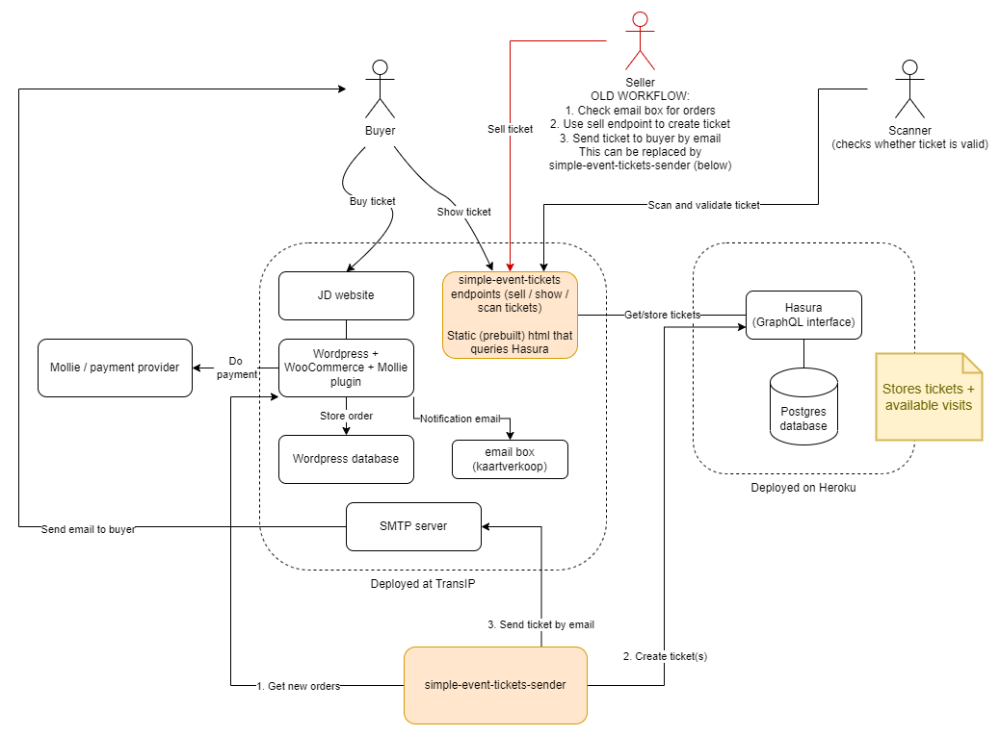

# Simple Event Tickets
A simple web app that creates / displays / validates QR code tickets using a Hasura/Postgres database.

## Description
There are three endpoints:

* sell - for creating tickets which will have to be sent by mail manually (see also [Simple Event Tickets Sender](https://github.com/kretep/simple-event-tickets-sender)).
* ticket - shows the ticket using the code in the url.
* scan - QR code scanner that validates a ticket.

The `sell` and `scan` endpoints require a JWT token to be filled (manually at the moment) for authentication.

TODO: add information about Hasura configuration for roles & permissions

## Example deployment overview



## Install

```
npm install
```

## Run dev

```
npm run dev -- --https
```

## Build
This builds a static version of the webapp with all the endpoints to src/dist:
```
npm run build
```
